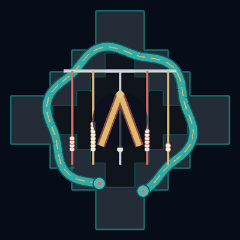

<!-- szl-investor-header -->
<div align="center">

# docs-site

### The unified documentation hub for everything SZL — quickstarts, how-to recipes, and the full technical reference for governed AI.

[](LICENSE) [](https://github.com/szl-holdings/docs-site/actions/workflows/deploy-pages.yml) [](https://github.com/szl-holdings/.github/tree/main/doctrine) [](https://slsa.dev/spec/v1.0/levels)

[Docs](https://holdings.a-11-oy.com/docs-site/) · [Quickstart](https://holdings.a-11-oy.com/docs-site/quickstart.html) · [Evidence](https://holdings.a-11-oy.com/docs-site/evidence/) · [Verify a receipt](https://a-11-oy.com/verify) · [SZL Holdings](https://a-11-oy.com)

</div>

## 💡 Why it matters

It is where investors, design partners, and engineers go to understand what SZL does, try it in minutes, and verify the claims for themselves — all in plain language with deep technical docs one click away.

## ▶️ Live documentation

**[Open the live documentation →](https://holdings.a-11-oy.com/docs-site/)**

[](https://holdings.a-11-oy.com/docs-site/)

<sub>_The SZL Holdings kanchay brand mark — click through to the live docs site above._</sub>

## ◇ Featured: the Holographic Estate

The Holographic Estate visualizes governed public surfaces as a 3D lattice. Treat the live
frontier API as the source for current inventory; this README does not hard-code a volatile count
or imply that every governed surface is reachable. Vendored WebGL2 with optional WebGPU; zero
runtime CDN; mobile-friendly.

**[Open the Holographic Estate →](https://a-11-oy.com/holographic)**

## ⚡ Quick start (30 seconds)

```bash
git clone https://github.com/szl-holdings/docs-site.git
cd docs-site
make quickstart   # or: open https://holdings.a-11-oy.com/docs-site/quickstart.html
```

## 🔍 How it works

In two sentences: this component is part of SZL's governed-AI mesh — it enforces policy and emits signed, replayable audit receipts so every AI action can be verified after the fact. The full mathematical foundation, formal proofs, and protocol details are documented below and in the [technical docs](https://holdings.a-11-oy.com/docs-site/).

---

<details>
<summary><strong>📐 Full technical detail, math, and proofs (the proof, not the pitch)</strong></summary>

# SZL Holdings — Unified Documentation Site

[](LICENSE)
[](https://github.com/szl-holdings/lutar-lean)
[](https://doi.org/10.5281/zenodo.19944926)
[](https://github.com/szl-holdings/docs-site/actions)
[](SECURITY.md)


<!-- CII Best Practices badge (founder-action required): register at https://bestpractices.coreinfrastructure.org/ to obtain a project ID, then replace this comment with the live badge. -->

The source for the live [SZL Holdings documentation portal](https://holdings.a-11-oy.com/docs-site/).
It documents the two SZL products (a11oy command platform + killinchu drones & vessels), the PURIQ
doctrine and master formula, the twelve anatomy organs plus the Killinchu bridge, the
Doctrine v11/v12 LOCKED contract numbers, the evidence ledger (DOIs, replay hash, Lean
artifacts), SDKs, API reference, cookbook, use cases, compliance, and brand.

---

## Why VitePress

The brief allowed VitePress, Docusaurus, or MkDocs Material. We chose **VitePress 1.6.x**.

| Requirement | How VitePress satisfies it |
| --- | --- |
| Dark + light mode | Built in to the default theme — no plugin, instant toggle, respects system preference. |
| Built-in search | Ships with local MiniSearch full-text indexing (no Algolia account, no external service, zero recurring cost). |
| KaTeX math | The PURIQ master formula and every organ sub-formula are LaTeX. We render them with `@vscode/markdown-it-katex` (a markdown-it plugin) — server-side at build time, so math is in the static HTML, fast and JS-light. |
| Mermaid diagrams | `vitepress-plugin-mermaid` integrates Mermaid into fenced ` ```mermaid ` blocks. Used for anatomy data-flow and DAG diagrams. |
| Copy-button + syntax highlighting | Built in (Shiki). Every code block gets a copy button and accurate highlighting with no configuration. |
| 3D iframes | Pages are plain markdown + HTML, so embedding the `*.static.hf.space` 3D showcases as `<iframe>` is trivial. |
| Fast static output, easy hosting | Vite-powered build emits a flat static bundle deployable beneath a static path prefix through GitHub Pages or another static host. |
| Lightweight | A Vue/Vite single-toolchain stack — far smaller dependency surface than Docusaurus (React + Webpack/Docusaurus core) and no Python runtime like MkDocs. Faster cold builds, simpler CI. |

Docusaurus was rejected as heavier than needed for a docs-only site (React app shell,
versioned-docs machinery we do not use). MkDocs Material was rejected because KaTeX +
Mermaid + Vue-style theming is less ergonomic and it adds a Python toolchain alongside the
Node tooling the rest of the SZL stack already uses.

---

## Project layout

```
szl_docs_site/
├── package.json                 # scripts + deps
├── docs/
│   ├── .vitepress/
│   │   ├── config.mjs           # nav, sidebar, search, KaTeX, Mermaid, fonts
│   │   ├── theme/
│   │   │   ├── index.js         # extends DefaultTheme
│   │   │   └── custom.css       # Kanchay brand tokens (navy/cyan/sand/clay/gold/ink)
│   │   └── dist/                # build output (generated — do not edit by hand)
│   ├── public/
│   │   └── img/                 # logo + 3d/ screenshots
│   ├── index.md                 # Home (hero, what is SZL, two products, CTAs)
│   ├── quickstart.md
│   ├── products/                # index + a11oy, killinchu
│   ├── anatomy/                 # index (12 organs + Killinchu bridge) + 3d-showcases
│   ├── doctrine/                # puriq (master formula), v11-v12 (LOCKED numbers)
│   ├── evidence/                # DOIs, replay hash, Lean, thesis, Khipu receipts
│   ├── sdks/                    # index + python + typescript
│   ├── api/                     # index + a11oy + killinchu (OpenAPI placeholders)
│   ├── cookbook/                # index + anatomy-evolved-v1
│   ├── use-cases/               # warhacker, greene-demo, iron-dome-brain, sovereign-gov
│   ├── compliance.md
│   ├── brand.md
│   ├── status.md
│   └── about.md
└── README.md                    # this file
```

---

## Develop & build

Prerequisites: Node 18+ and npm.

```bash
# install dependencies
npm install

# live dev server with hot reload (http://localhost:5173)
npm run docs:dev

# production build → docs/.vitepress/dist/
npm run docs:build

# preview the production build locally (http://localhost:4173)
npm run docs:preview
```

---

## How to update content

1. **Edit or add a page.** Pages are Markdown under `docs/`. Front-matter at the top of a
   file controls layout (e.g. `layout: home` on `index.md`).
2. **Add it to the sidebar/nav.** Edit `docs/.vitepress/config.mjs` — the `nav` array is the
   top bar, the `sidebar` object maps URL path prefixes to their link groups.
3. **Math:** write LaTeX inside `$ ... $` (inline) or `$$ ... $$` (block). KaTeX renders it
   at build time.
4. **Diagrams:** use a fenced ` ```mermaid ` block.
5. **Code:** standard fenced code blocks get syntax highlighting and a copy button
   automatically. Add a language hint (` ```python `, ` ```ts `, ` ```bash `).
6. **Images / screenshots:** drop files in `docs/public/img/` and reference them as
   `/img/yourfile.png` (the `public/` prefix is stripped at build).
7. **Brand colors** live as CSS custom properties in `docs/.vitepress/theme/custom.css`
   (Kanchay tokens). Adjust there to retheme globally.
8. Run `npm run docs:build`, eyeball with `npm run docs:preview`, then deploy.

### Editing the LOCKED contract numbers

The Doctrine v11 LOCKED numbers (749 declarations / 14 unique axioms / 163 sorries /
13-axis yuyay_v3 / replay hash `bacf54434f1a3bf2d758b27a62d5fd580ca4c8d3b180693573eeebcaea631fc5`)
are quoted verbatim on `doctrine/v11-v12.md`, `evidence/index.md`, and the home page. These
are a frozen contract — do **not** change them to track live corpus growth. The live
snapshot (which drifts) is reported separately and labelled as such. If the doctrine is
re-locked at a new version, update all three pages together and bump the version label.

---

## Deploy & the canonical-path build design

The build emits a static bundle at `docs/.vitepress/dist/` for the canonical GitHub Pages
`/docs-site/` prefix. The release fails closed when generated local navigation leaves that base
or points to an absent file:

1. **`base: '/docs-site/'` with the hydrated VitePress client** in `config.mjs`. The exact public
   path is part of the source contract, while search, mobile navigation, appearance controls,
   and keyboard interaction remain operational after the initial static HTML renders.
2. **`fix-relative-paths.mjs`** adds pre-hydration accessibility attributes and publishes the
   checked raw trust assets without rewriting VitePress navigation.
3. **`scripts/verify-built-links.mjs`** crawls every generated `href` and `src` that targets
   the canonical host, rejects paths outside `/docs-site/`, and requires the target file to exist.
4. **`scripts/deployment-manifest.mjs`** inventories the final upload bytes after all build
   rewrites, binds them to protected `main` plus the exact Pages workflow revision, and refuses
   unprotected, stale, malformed, or overwritten evidence.
5. **`scripts/witness-deployment.mjs`** reads the public `deployment.json` and critical live
   files back from the canonical host with exact SHA-256 and byte-count checks.

- **Canonical public host:** `https://holdings.a-11-oy.com/docs-site/`, deployed from protected
  `main` through GitHub Pages Actions.
- **Checked artifact:** the build is bound to `/docs-site/` and its local link graph is verified
  before upload. The live [deployment manifest](https://holdings.a-11-oy.com/docs-site/deployment.json)
  records the exact protected source and uploaded file inventory; the workflow witnesses the
  critical public bytes before reporting success. DNS and Pages HTTPS policy are managed outside
  this source repository and are not inferred from a successful build.
- **Origin-wide contracts:** this subpath bundle deliberately does not claim to publish
  `/robots.txt` or `/.well-known/security.txt`. Those standard locations must be served by the
  owner of `https://holdings.a-11-oy.com/`; a file beneath `/docs-site/` would not satisfy crawler
  or security-contact discovery.

---

## Source repository

`github.com/szl-holdings/docs-site`

---

Maintained by SZL Holdings. Content is the SZL doctrine of record; the LOCKED numbers are a
contract. NO BANDAID. Math-grounded, Quechua-rooted.

— Yachay

## SZL Holdings



*The SZL Holdings animated mark (400×400, 16fps loop). Signed Yachay.*


</details>

<!-- szl-doctrine-footer -->

---

### Citation & doctrine

Cite this work via [`CITATION.cff`](CITATION.cff). Math foundations: [szl-papers](https://github.com/szl-holdings/szl-papers) · [lutar-lean](https://github.com/szl-holdings/lutar-lean) (kernel `c7c0ba17`).

**SZL estate:** [a11oy console](https://a-11-oy.com) · [LLM Router](https://github.com/szl-holdings/szl-router) · [Receipt format spec](https://github.com/szl-holdings/governed-receipt-spec) · [🤗 SZLHOLDINGS](https://huggingface.co/SZLHOLDINGS)

<sub>Λ Conjecture 1 (not a theorem) · 749/14/163 v11 LOCKED (kernel `c7c0ba17`) · SLSA Build L1 honest (cosign keyless-signed, Rekor-anchored images) · L2 verified-provenance on the roadmap; L3 / FedRAMP / Iron Bank / CMMC not claimed · locked-proven formulas = 8 {F1,F4,F7,F11,F12,F18,F19,F22} (`locked_count_eight`) · Section 889 = 5 vendors · [SZL Holdings](https://a-11-oy.com) · Apache-2.0 code · CC-BY-4.0 papers</sub>
