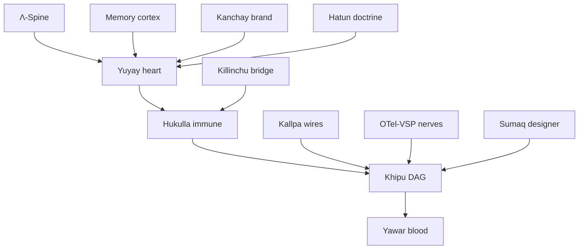

# Anatomy + Organs

The SZL anatomy is a set of composable **organs**. Each organ is named for a precise Quechua
common noun (or, where honestly labelled, an acronym/coinage), has one **function**, one
**formula**, and one **Lean stub** that states its proof obligation in
[`lutar-lean`](https://github.com/szl-holdings/lutar-lean) or the PURIQ suite
(`formulas/PuriqLean.lean`). Every organ exposes the `puriq.{decide, act, reflect}`
interface defined in [Doctrine v12](/doctrine/puriq).

The master action-selection operator that ties them together is

$$ P(x,t) = \operatorname*{arg\,max}_{a \in \mathcal{A}} \Big[\; \Lambda(x)\cdot \mathrm{Yuyay}_{13}(a)\cdot e^{-\beta\,\mathrm{HUKLLA}(a)}\cdot \textstyle\prod_i \mathrm{Khipu}_i(a)\;\Big]. $$

Each organ below is a **specialisation** of this operator. Every extra factor lies in $[0,1]$
and is non-negative, so it can only shrink the gated region — never bypass a gate.

| # | Organ | Quechua / origin | Function |
|---|-------|------------------|----------|
| 1 | [Memory](#memory) | provenance & receipt cortex | Memory cortex / high-stakes reasoning |
| 2 | [Yuyay](#yuyay) | *yuyay* = thought/memory/wisdom | The 13-axis heart (admission gate) |
| 3 | [Yawar](#yawar) | *yawar* = blood | Circulatory receipt ledger |
| 4 | [Hukulla](#hukulla) | HUKLLA acronym | Immune deadman / kill-switch |
| 5 | [Kallpa](#kallpa) | *kallpa* = strength/energy | Wires / propagation budget |
| 6 | [Khipu](#khipu) | *khipu* = knotted-cord record | Receipt DAG / Merkle accumulator |
| 7 | [Lambda](#lambda) | Λ math primitive | Spine aggregator |
| 8 | [OTel-VSP](#otel-vsp) | OpenTelemetry | Nervous / observability fiber |
| 9 | [Kanchay](#kanchay) | *kanchay* = light/radiance | Brand / public-claim surface |
| 10 | [Hatun](#hatun) | *hatun* = great/large | Doctrine governance |
| 11 | [Sumaq](#sumaq) | *sumaq* = beautiful/fine | Designer / proof discharge |
| 12 | [Killinchu-bridge](#killinchu-bridge) | *killinchu* = kestrel | Embodied (physical-space) bridge |

<strong>Glosses.</strong> All common-noun glosses follow Wiktionary and the standard Quechua
lexica indexed at <a href="https://kaikki.org/eswiktionary/">kaikki.org</a> and
<a href="https://en.wiktionary.org/wiki/puriy">Wiktionary <em>puriy/puriq</em></a>.
<em>HUKLLA</em> is the SZL acronym (Hardened Unambiguous Kill-switch, Latch &amp; Lineage
Authority). No mystical terms are used anywhere.

---

## 1 · Memory — cortex {#memory}

- **Function:** memory cortex / high-stakes reasoning (a11oy.code PRIME tier). Action space
  $\mathcal{A}$ = candidate multi-step reasoning plans over recalled memory.
- **Formula (SF-01):** a KL **drift penalty** regularises plans toward a calibrated reference —

$$ P_{\text{Memory}}(x,t)=\operatorname*{arg\,max}_{a}\Big[\Lambda(x)\,\mathrm{Yuyay}_{13}(a)\,e^{-\beta\,\mathrm{HUKLLA}(a)}\,e^{-\gamma\,\mathrm{KL}(p_a\|p_{\text{ref}})}\,\textstyle\prod_i\mathrm{Khipu}_i(a)\Big]. $$

  The KL/Pinsker discipline is the v11 `pinsker_kl_bound`
  ([Cover & Thomas §11.6](https://doi.org/10.1002/047174882X)).
- **Lean stub:** `Lutar/DPI/DPIBound.lean` (`pinsker_kl_bound`); PURIQ factor in `formulas/PuriqLean.lean`.

## 2 · Yuyay — heart {#yuyay}

- **Etymology:** Quechua *yuyay* = **thought / memory / wisdom**.
- **Function:** the **13-axis heart** (HEART tier). This *is* the admission gate — conjunctive
  AND, no compensation. Replay-hash anchor `bacf5443…631fc5`.
- **Formula (SF-02):** the gate is the indicator product over all 13 axes —

$$ \mathrm{Yuyay}_{13}(a)=\prod_{j=1}^{13}\mathbf{1}\!\left[s_j(a)\ge \phi_j\right],\quad \phi_{1,2}=0.95,\ \phi_{3..9}=0.90,\ \phi_{10..13}:\text{T03/T04/T09/T10 cleared.} $$

  Five axes operationalise the **Situated Wise Reasoning Scale**
  ([Brienza et al. 2018, *JPSP*](https://doi.org/10.1037/pspp0000171)).
- **Lean stub:** the conjunctive gate; obligations in `formulas/PuriqLean.lean`. Kernel: 430 SLOC Python `yuyay_v3`.

## 3 · Yawar — blood {#yawar}

- **Etymology:** Quechua *yawar* = **blood**.
- **Function:** the circulatory **receipt ledger** (20 lines of Python; **RUWAY** is the only
  authorised writer). Action space = ledger-append actions, one per organ emission.
- **Formula (SF-03):** the **chain-link indicator** folds into the Khipu product —

$$ C(a) = \mathbf{1}\big[\, \mathrm{sha256}(\text{prev}\,\|\,\text{packet}_a) = \text{root}_a \,\big]. $$

  Receipt rule: `packet → json.dumps(sort_keys=True) → sha256 → hexdigest → append`.
- **Lean stub:** chain-link obligation in `formulas/PuriqLean.lean`; receipt rule in Doctrine v11 §4.

## 4 · Hukulla — immune {#hukulla}

- **Etymology:** **HUKLLA** acronym — Hardened Unambiguous Kill-switch, Latch & Lineage
  Authority (an SZL acronym, labelled honestly; not a Quechua word).
- **Function:** the immune deadman — **660 SLOC, 10 deterministic tripwires (T01–T10)**. T10
  (STOP/undo/revert) is an absorbing halt.
- **Formula (SF-04):** the **soft halt**, with $\beta$ large so any fired tripwire dominates —

$$ \mathrm{HUKLLA}(a)=\sum_{k=1}^{10}\mathbf{1}[T_k\text{ fires}],\qquad \text{utility} \propto e^{-\beta\,\mathrm{HUKLLA}(a)},\ \beta\gg 0. $$

  Compound risk is bounded by **Egyptian recursive doubling**
  $\mathrm{HUKLLA}(a_1\ldots a_n)\le\sum 2^{k_i}$
  ([Rhind Mathematical Papyrus, British Museum EA10057](https://www.britishmuseum.org/collection/object/Y_EA10057)).
- **Lean stub:** `puriq_halting_safety` in `formulas/PuriqLean.lean`; doubling in `Lutar/Egyptian/AkhmimTable.lean`.

## 5 · Kallpa — wires {#kallpa}

- **Etymology:** Quechua *kallpa* = **strength / energy**.
- **Function:** the **wires / propagation** organ (FAST tier). Decides continue-vs-stop per step.
- **Formula (SF-05):** a **Butler–Volmer** halt budget — continue only while the marginal
  overpotential keeps current above the activation threshold —

$$ i(\eta)=i_0\!\left(e^{\frac{\alpha_a F \eta}{RT}}-e^{-\frac{\alpha_c F \eta}{RT}}\right),\qquad \text{continue}\iff i(\eta)\ge i_{\text{act}}. $$

  A principled stop condition, not an arbitrary step cap
  ([Bard & Faulkner, *Electrochemical Methods* §3.3](https://www.wiley.com/en-us/Electrochemical+Methods%3A+Fundamentals+and+Applications%2C+2nd+Edition-p-9780471043720)).
- **Lean stub:** budget factor `B(a)` in `formulas/PuriqLean.lean`.

## 6 · Khipu — DAG {#khipu}

- **Etymology:** Quechua *khipu* = **knotted-cord record** (the Inka accounting cords).
- **Function:** the receipt **DAG / Merkle accumulator**. Action space = DAG-edge insertions.
- **Formula (SF-06):** Merkle-root recomputation + the **summation-cord invariant** —

$$ M(a)=\mathbf{1}\!\left[\text{root}'=H(\text{root}\,\|\,\text{leaf}_a)\right],\qquad \sum_{\text{root}}=\sum_{\text{pendants}}\Big(\sum_{\text{sub-pendants}}\Big). $$

  Integrity by additive arithmetic, not collision-resistance alone
  ([Urton, *Signs of the Inka Khipu*, UT Press 2003](https://utpress.utexas.edu/9780292785403/)).
- **Lean stub:** `Lutar/Khipu/SummationInvariant.lean`; `puriq_khipu_integrity` in `formulas/PuriqLean.lean`.

## 7 · Lambda — spine {#lambda}

- **Etymology:** Λ — a math primitive (the aggregator backbone), not a word.
- **Function:** the **spine aggregator** — collapses a 13-vector to one trust scalar.
- **Formula (SF-07):** the canonical **weighted geometric mean** (definition D2) —

$$ \Lambda(x)=\prod_{i=1}^{k} x_i^{\,w_i},\qquad \sum_i w_i=1,\ w_i>0,\ x_i\in[0,1]. $$

  Carries A1 `IsMonotone`, **A2 `IsHomogeneous`** (degree 1), A3 `IsEgyptianExact`,
  **A4 `IsBounded`** ($\Lambda(x)\le\max_i x_i$). **Λ-uniqueness remains
  [Conjecture 1](/doctrine/v11-v12#conjecture-1)**, not a theorem.
- **Lean stub:** `Lutar/Axioms.lean`; `puriq_lambda_monotone` in `formulas/PuriqLean.lean`.

## 8 · OTel-VSP — nerves {#otel-vsp}

- **Etymology:** **OpenTelemetry** + **V**erifiable **S**pan **P**rovenance (engineering term).
- **Function:** the **nervous / observability fiber** — the W3C `traceparent` spine.
- **Formula (SF-08):** the **trace-continuity** indicator —

$$ O(a)=\mathbf{1}\big[\,\mathrm{traceparent}(\text{child}_a)\text{ extends }\mathrm{traceparent}(\text{parent})\,\big]. $$

  ([W3C Trace Context](https://www.w3.org/TR/trace-context/)).
- **Honest label:** `traceparent_propagated` is **in-process only**. Cross-mesh W3C
  propagation (Wire D) is **in development** — `O(a)` is honest within a single Space only.
- **Lean stub:** trace-continuity factor in `formulas/PuriqLean.lean`.

## 9 · Kanchay — brand {#kanchay}

- **Etymology:** Quechua *kanchay* = **light / radiance**.
- **Function:** the **brand / public-claim** surface. Action space = public-claim emissions.
  *(Kanchay is also the source of the [brand color tokens](/brand) used by this site.)*
- **Formula (SF-09):** the **claim-calibration** indicator on the two sacred axes —

$$ K(a)=\mathbf{1}\big[\,\mathrm{moralGrounding}(a)\ge 0.95\ \wedge\ \mathrm{measurabilityHonesty}(a)\ge 0.95\,\big]. $$

  Enforces the v11 banned-claims register (no "SLSA L3", no "zero sorry", no unscoped
  "fully verified").
- **Lean stub:** `K(a)` collapses to T01/T02 hard-fail tripwires; obligation in `formulas/PuriqLean.lean`.

## 10 · Hatun — doctrine {#hatun}

- **Etymology:** Quechua *hatun* = **great / large**.
- **Function:** **doctrine governance**. Action space = doctrine-amendment proposals.
- **Formula (SF-10):** the **monotone-additivity** guard —

$$ D(a)=\mathbf{1}\big[\,a\text{ is additive}\ \wedge\ a\text{ edits no LOCKED number}\,\big]. $$

  This is what makes "v12 = v11 + PURIQ, no edits" structurally enforceable: any action that
  would change a [LOCKED number](/doctrine/v11-v12) yields $D(a)=0$.
- **Lean stub:** additivity guard in `formulas/PuriqLean.lean`; HR-3 / HR-7 in Doctrine v11.

## 11 · Sumaq — designer {#sumaq}

- **Etymology:** Quechua *sumaq* = **beautiful / fine**.
- **Function:** the **designer / proof-discharge** organ (FRONTIER tier) — the aesthetic of an
  honest proof. Action space = proof-discharge / artifact-shaping actions.
- **Formula (SF-11):** the **honest-proof** indicator —

$$ S(a)=\mathbf{1}\big[\,\text{every sorry in }a\text{ is tagged}\ \wedge\ \mathrm{proof\_status}(a)\in\{\text{PROVEN, SORRY, AXIOM, CONJECTURE}\}\,\big]. $$

  A hidden `sorry` sets $S(a)=0$ — Zero-Bandaid enforced inside the selection operator.
- **Lean stub:** status-tag obligation in `formulas/PuriqLean.lean`; canonical-formulas registry (v11 §12).

## 12 · Killinchu-bridge — embodied agent {#killinchu-bridge}

- **Etymology:** Quechua *killinchu* = **kestrel** (a small Andean falcon).
- **Function:** the **physical-space bridge** — extends digital governance to embodied
  actuation (the [killinchu flagship](/flagships/killinchu) drone vertical). Action space =
  physical-actuation commands.
- **Formula (SF-12):** a **geofence + dynamics-feasibility** indicator —

$$ G(a)=\mathbf{1}\big[\,\mathrm{pose}(a)\in\mathcal{S}_{\text{safe}}\ \wedge\ \|u(a)\|\le u_{\max}\,\big]. $$

  The geofence is the embodied analogue of the **Bekenstein** action-space bound
  ([INV-4](/doctrine/puriq)): a drone cannot enumerate an unbounded physical action space
  ([LaValle, *Planning Algorithms*, ch. 13–15](http://lavalle.pl/planning/)).
- **Lean stub:** feasibility factor `G(a)` in `formulas/PuriqLean.lean`.

---

## Invariant-preservation summary

Every organ factor lies in $[0,1]$ and is non-negative, so multiplying the master utility by
it can only **shrink** the gated region — never bypass a gate. The four master invariants
([INV-1…INV-4](/doctrine/puriq)) therefore hold for every organ by construction.

| Organ | Extra factor | Range | Invariant it anchors |
|-------|--------------|-------|----------------------|
| Memory | $e^{-\gamma\mathrm{KL}}$ | $(0,1]$ | preserves INV-1…4 |
| Yuyay | identity (the gate) | $\{0\}\cup(0,1]$ | algebraic root of INV-1 |
| Yawar | $C(a)$ chain-link | $\{0,1\}$ | folds into Khipu → INV-3 |
| Hukulla | $e^{-\beta H}$, $\beta\gg0$ | $(0,1]$ | INV-1 `puriq_halting_safety` |
| Kallpa | $B(a)$ BV budget | $\{0,1\}$ | preserves INV-1…4 |
| Khipu | Merkle / sum indicator | $\{0,1\}$ | INV-3 `puriq_khipu_integrity` |
| Lambda | $\Lambda(x)$ itself | $[0,1]$ | INV-2 `puriq_lambda_monotone` |
| OTel-VSP | $O(a)$ trace-continuity | $\{0,1\}$ | preserves INV-1…4 |
| Kanchay | $K(a)$ sacred-axis | $\{0,1\}$ | INV-1 (T01/T02) |
| Hatun | $D(a)$ additivity | $\{0,1\}$ | locks v11 numbers |
| Sumaq | $S(a)$ honest-proof | $\{0,1\}$ | Zero-Bandaid |
| Killinchu | $G(a)$ geofence | $\{0,1\}$ | INV-4 (bounded $\mathcal{A}$) |

Full derivations and citations: [PURIQ Doctrine](/doctrine/puriq) and the sub-formula suite.
Lean obligations live in `formulas/PuriqLean.lean` (all `sorry`-tagged, none hidden).
