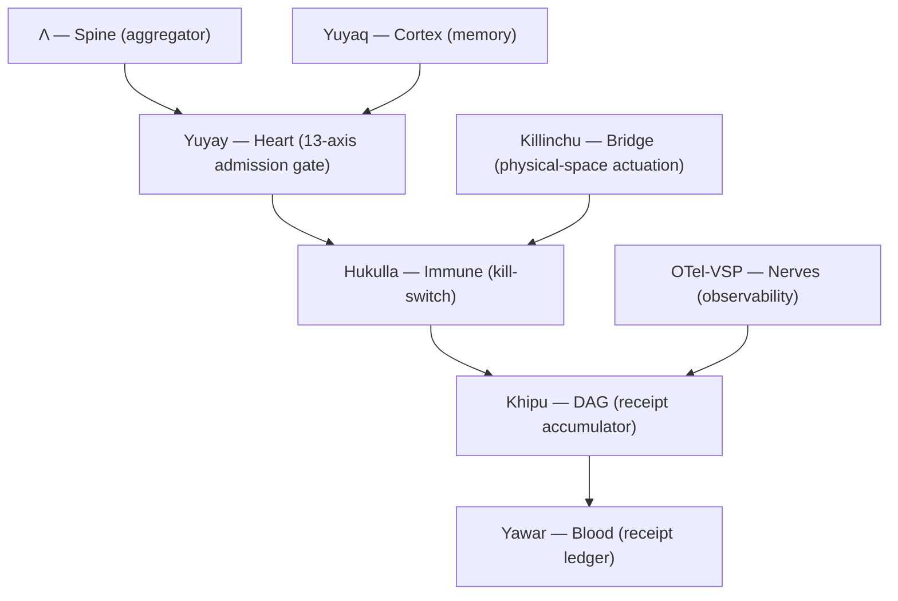

# Architecture — the 7-organ anatomy

SZL Holdings is built as a composable **anatomy**: a small set of organs, each with one
function, one formula, and one Lean proof obligation in
[`lutar-lean`](https://github.com/szl-holdings/lutar-lean). This page shows the load-bearing
**7-organ** core that every flagship specialises. The full 12-organ map lives in
[Anatomy + Organs](/anatomy/).

> Doctrine v11 **LOCKED** — 749 declarations / 14 unique axioms / 163 tracked sorries ·
> kernel `c7c0ba17`. **Λ = Conjecture 1** (not a theorem). SLSA L1 honest.
> Section 889 = exactly 5 vendors.

## The 7-organ core

| # | Organ | Role | Flagship that embodies it |
|---|-------|------|---------------------------|
| 1 | **Λ — Spine** | Aggregator; bounds every decision | a11oy (gate); Policy role (Λ-threshold, roadmap) |
| 2 | **Yuyay — Heart** | 13-axis conjunctive admission gate (no compensation) | a11oy + killinchu (the `yuyay_v3` score) |
| 3 | **Yuyaq — Cortex** | Memory cortex; COSE-receipted reads/writes | Provenance Anchor role (roadmap) |
| 4 | **Hukulla — Immune** | Deny-by-default kill-switch / tripwires | Policy role (roadmap); gate lives in a11oy |
| 5 | **Khipu — DAG** | Merkle receipt accumulator; sum invariant | Operator role (roadmap); DAG lives in a11oy |
| 6 | **Yawar — Blood** | Circulatory receipt ledger | a11oy `/v1/ledger` |
| 7 | **Killinchu — Bridge** | Extends digital governance to physical space | killinchu (counter-UAS) |

## The master operator

Every organ is a specialisation of one action-selection operator. Each extra factor lies in
\([0,1]\), so it can only **shrink** the gated region — never bypass a gate:

\[
P(x,t) = \operatorname*{arg\,max}_{a \in \mathcal{A}} \Big[\; \Lambda(x)\cdot \mathrm{Yuyay}_{13}(a)\cdot e^{-\beta\,\mathrm{HUKLLA}(a)}\cdot \textstyle\prod_i \mathrm{Khipu}_i(a)\;\Big].
\]

The operator and each organ's proof obligation are defined in
[Doctrine v11 + v12](/doctrine/v11-v12) and proven (or honestly `sorry`-tagged) in the
[Lean kernel](/proof). See the [3D showcases](/anatomy/3d-showcases) for interactive
renderings of the spine, heart, and Khipu DAG.

## How a request flows

1. A request enters through the Operator console surface (roadmap) or directly at a shipping
   flagship API (a11oy / killinchu).
2. The **Λ-spine** scores it; the **Yuyay heart** applies the 13-axis conjunctive gate.
3. The **Hukulla immune** layer can hard-stop (deny by default).
4. Every accepted decision emits a **Khipu** receipt into the **Yawar** ledger.
5. **OTel-VSP** propagates a W3C `traceparent` across the mesh for observability.

## Governance-ring capabilities

Beyond the 7-organ core, a11oy ships six named **governance rings** — each a real served module on the substrate (shared byte-identical with killinchu where noted). All claims below are MODELED/honest where hardware is not yet wired, never overstated.

| Ring | Quechua sense | What it does (honest scope) |
|------|---------------|------------------------------|
| **WILLAY** (`szl_willay_gateway`) | "to disclose" | Inspectable model-call governance gateway — the honest inverse of a hidden safety governor: every routed call passes inspectable classifiers built on the Restraint ladder, the Constitution, and Khipu 3-of-4 consensus, returning a **signed** verdict *and* its reasoning. |
| **WAQAY** (`szl_waqay`) | "to safeguard" | Governed, air-gapped, signed quantized vector index for a11oy's RAG (pure-NumPy re-implementation of the data-oblivious TurboQuant approach; perf is MODELED/roadmap, never claimed to match native crates). |
| **YUPAY** (`szl_yupay`) | "to reckon / audit" | Governed multi-model audit harness — runs the same audit task through multiple models, scores issues-found / tokens / cost / latency, and emits one DSSE-signed comparison receipt. Trains/serves no model itself. |
| **QHAWAQ** (`szl_qhawaq`) | "the watcher" | Runtime constitutional intercept (Glass-Box-style, LTL ring) sitting between agent policy and effectors; checks each proposed action against constitutional constraints + safety invariants before any command reaches an effector. |
| **SAPA** (`szl_sapa`) | "each / the whole" | Energy-per-Successful-Goal accounting layer — sums MEASURED joules across a full agent trajectory and reports joules / successful goal, success rate, and an agentic multiplier, with a DSSE-signed energy-per-goal receipt. |
| **MBSE** (`szl_mbse_cosim`) | model-based systems eng. | Governed MBSE / FMI co-simulation digital-twin core (shared, byte-identical across a11oy + killinchu): governed water-tank co-sim, a SIMULATED 6DOF vessel/UAS twin (never actuates real hardware), and a requirement → Lean → FMU → signed-receipt pipeline. Deterministic (fixed-step, fixed-seed → reproducible receipt hash). |

Each ring only ever **shrinks** the permitted action region — none can bypass a gate — and every consequential step emits a signed Khipu/Yawar receipt.

---
*Doctrine v11 LOCKED · 749/14/163 · kernel c7c0ba17 · Λ = Conjecture 1 · SLSA L1 honest*
