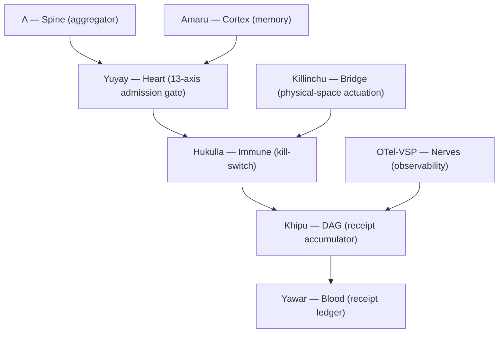

# Architecture — the 7-organ anatomy

SZL Holdings is built as a composable **anatomy**: a small set of organs, each with one
function, one formula, and one Lean proof obligation in
[`lutar-lean`](https://github.com/szl-holdings/lutar-lean). This page shows the load-bearing
**7-organ** core that every flagship specialises. The full 12-organ map lives in
[Anatomy + Organs](/anatomy/).

> Doctrine v11 **LOCKED** — 749 declarations / 14 unique axioms / 163 tracked sorries ·
> kernel `c7c0ba17`. **Λ = Conjecture 1** (not a theorem). SLSA L1 honest.
> Section 889 = exactly 5 vendors.

## The 7-organ core

| # | Organ | Role | Flagship that embodies it |
|---|-------|------|---------------------------|
| 1 | **Λ — Spine** | Aggregator; bounds every decision | a11oy (gate), sentra (Λ-threshold) |
| 2 | **Yuyay — Heart** | 13-axis conjunctive admission gate (no compensation) | all 5 (the `yuyay_v3` score) |
| 3 | **Amaru — Cortex** | Memory cortex; COSE-receipted reads/writes | amaru |
| 4 | **Hukulla — Immune** | Deny-by-default kill-switch / tripwires | sentra |
| 5 | **Khipu — DAG** | Merkle receipt accumulator; sum invariant | rosie |
| 6 | **Yawar — Blood** | Circulatory receipt ledger | a11oy `/v1/ledger` |
| 7 | **Killinchu — Bridge** | Extends digital governance to physical space | killinchu (counter-UAS) |

## The master operator

Every organ is a specialisation of one action-selection operator. Each extra factor lies in
\([0,1]\), so it can only **shrink** the gated region — never bypass a gate:

\[
P(x,t) = \operatorname*{arg\,max}_{a \in \mathcal{A}} \Big[\; \Lambda(x)\cdot \mathrm{Yuyay}_{13}(a)\cdot e^{-\beta\,\mathrm{HUKLLA}(a)}\cdot \textstyle\prod_i \mathrm{Khipu}_i(a)\;\Big].
\]

The operator and each organ's proof obligation are defined in
[Doctrine v11 + v12](/doctrine/v11-v12) and proven (or honestly `sorry`-tagged) in the
[Lean kernel](/proof). See the [3D showcases](/anatomy/3d-showcases) for interactive
renderings of the spine, heart, and Khipu DAG.

## How a request flows

1. A request enters through an operator surface ([rosie](/flagships/rosie)) or directly at a
   flagship API.
2. The **Λ-spine** scores it; the **Yuyay heart** applies the 13-axis conjunctive gate.
3. The **Hukulla immune** layer can hard-stop (deny by default).
4. Every accepted decision emits a **Khipu** receipt into the **Yawar** ledger.
5. **OTel-VSP** propagates a W3C `traceparent` across the mesh for observability.

---
*Doctrine v11 LOCKED · 749/14/163 · kernel c7c0ba17 · Λ = Conjecture 1 · SLSA L1 honest*
