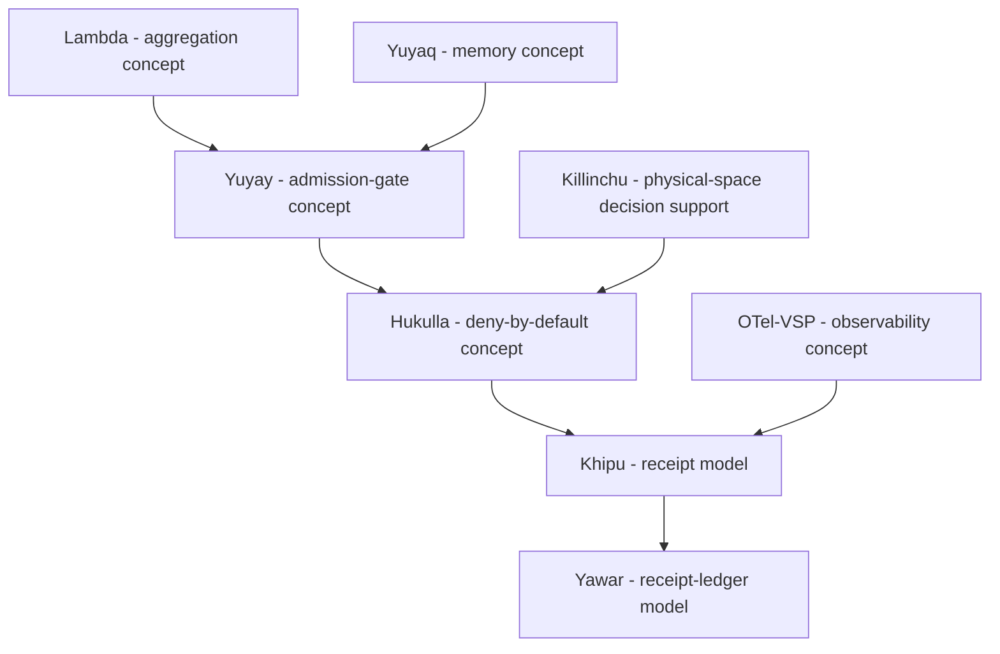

# Architecture - the 7-organ anatomy

SZL documents a composable governance anatomy: named components, a proposed action-selection
operator, source implementations, and a Lean proof corpus. It is a design and source map, not a
claim that each organ is independently deployed, currently available, or fully formally proved.

> **Proof posture:** Doctrine v11 LOCKED records 749 declarations, 14 unique axioms, and 163
> tracked sorries at kernel `c7c0ba17`. Lambda is Conjecture 1, not a theorem. See
> [Evidence](/evidence/) and [Proof](/proof).

## The 7-organ core

```mermaid
flowchart TD
  L["Lambda - aggregation concept"] --> Y["Yuyay - admission-gate concept"]
  A["Yuyaq - memory concept"] --> Y
  Y --> H["Hukulla - deny-by-default concept"]
  H --> K["Khipu - receipt model"]
  K --> W["Yawar - receipt-ledger model"]
  O["OTel-VSP - observability concept"] --> K
  KI["Killinchu - physical-space decision support"] --> H
```

| Organ | Documented role | Product/role relationship | Status boundary |
|-------|-----------------|---------------------------|-----------------|
| Lambda | aggregator and decision-bound concept | a11oy gate / Policy role | `CONJECTURE 1`; standalone Policy role is roadmap |
| Yuyay | 13-axis conjunctive admission model | a11oy and killinchu documentation | decision aid, not a safety proof |
| Yuyaq | memory and provenance concept | Provenance Anchor role | standalone role is roadmap |
| Hukulla | deny-by-default and tripwire concept | a11oy / Policy role | standalone role is roadmap |
| Khipu | receipt-DAG model and sum invariant | a11oy / Operator role | signature status is artifact-specific |
| Yawar | receipt-ledger concept | a11oy source routes | runtime status must be checked separately |
| Killinchu | physical-space decision-support bridge | killinchu flagship | no effector or autonomous lethal-action claim |

## The master operator

The doctrine defines the following proposed action-selection operator:

\[
P(x,t) = \operatorname*{arg\,max}_{a \in \mathcal{A}} \Big[\; \Lambda(x)\cdot \mathrm{Yuyay}_{13}(a)\cdot e^{-\beta\,\mathrm{HUKLLA}(a)}\cdot \textstyle\prod_i \mathrm{Khipu}_i(a)\;\Big].
\]

The operator and associated obligations are defined in [Doctrine v11 + v12](/doctrine/v11-v12).
Some Lean results are locked-proven and others are honestly `sorry`-tagged; consult
[Evidence](/evidence/) for the exact pinned scope. No page should treat this equation as a proof
of overall system safety.

## Reading a documented request flow

The architecture describes this intended flow:

1. A request reaches a documented flagship source surface or future Operator role.
2. The Lambda and Yuyay concepts evaluate the stated policy boundary.
3. The Hukulla concept can represent a deny-by-default stop condition.
4. A Khipu/Yawar receipt model records the decision boundary.
5. The observability design may associate trace context with the flow.

This flow is not evidence of a live distributed service mesh. Cross-service wiring, telemetry, and
current public availability are controlled by [Runtime status](/status).

## Governance-ring references

The following names appear in source and architecture documentation. The table deliberately does
not claim that they are independent hosted modules, hardware integrations, or signed runtime
services without an exact cited artifact.

| Ring | Documented scope | Evidence boundary |
|------|------------------|-------------------|
| WILLAY | inspectable model-call governance gateway design | exact runtime and signature status require an artifact check |
| WAQAY | governed quantized-vector-index design | performance is `MODELED` / roadmap where not evidenced |
| YUPAY | multi-model audit-harness design | a receipt claim is not a signature claim without verification |
| QHAWAQ | constitutional-intercept design | no independent runtime availability implied |
| SAPA | energy-per-successful-goal accounting design | measured joules require a cited measurement artifact |
| MBSE | governed co-simulation and digital-twin design | simulated twin is not real-hardware actuation |

Receipt integrity, signing, supply-chain, and certification claims are governed by
[Compliance](/compliance). For a public-safe investment reading of these boundaries, see the
[Investor brief](/investors/).
