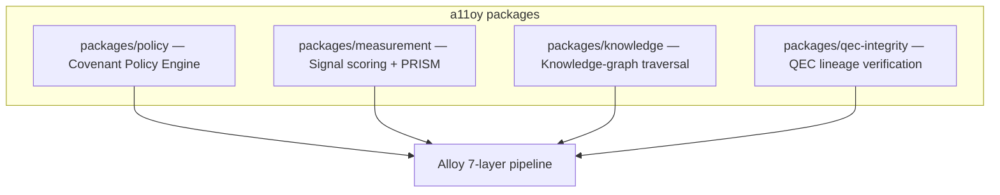

# a11oy — governed agentic execution fabric

<div class="quechua">
<strong>Etymology.</strong> <em>a11oy</em> is a coinage on the English word
<strong>alloy</strong> — a blended, hardened metal — styled in the <code>a11y</code>
numeronym form. It is <em>not</em> a Quechua word, and is labelled as such honestly. The
metaphor is load-bearing: a11oy is the substrate that fuses policy, measurement, knowledge,
and integrity into one governed material.
</div>

## Overview

`a11oy` is the **seven-layer governed agentic execution fabric** of SZL Holdings — the
substrate that connects live enterprise signals to human-confirmed decisions with
cryptographic proof at every transition. It ships TypeScript packages consumed by the
[`szl-holdings/platform`](https://github.com/szl-holdings/platform) monorepo.

> **Frontier capability.** First agent-execution fabric with a Lean-verified termination +
> Λ-monotonicity proof — `Lutar.AgentLoop.terminates` + `Lutar.AgentLoop.preserves_lambda`
> ([Ouroboros Thesis DOI 10.5281/zenodo.20434276](https://doi.org/10.5281/zenodo.20434276)).

**Anatomy mapping:** a11oy is the integration host; in the
[a11oy.code](/doctrine/v11-v12) tier→organ router it routes PRIME→[Amaru](/anatomy/#amaru),
HEART→[Yuyay](/anatomy/#yuyay), IMMUNE→[Sentra](/anatomy/#hukulla).



## How it works — the 7-layer pipeline

Every action passes through the fabric before execution:

1. **Signal ingress** — `measurement` scores events against PRISM baselines.
2. **Knowledge context** — `knowledge` retrieves domain ontology for explanation.
3. **Policy evaluation** — `policy` checks the action against Covenant Policy rules.
4. **Approval gate** — human approval is created when policy requires it.
5. **Execution unlock** — the action proceeds only after gate resolution.
6. **QEC verification** — `qec-integrity` verifies proof-chain cryptographic lineage.
7. **Receipt** — the decision is emitted to the [rosie](/flagships/rosie) Khipu DAG.

The **Λ-invariant** constrains step 3: no recommendation below the configured confidence
threshold reaches the approval gate without escalation.

## Packages

| Package | Purpose | Key types |
|---------|---------|-----------|
| `packages/policy` | Covenant Policy Engine — evaluates actions against governance rules | `CovenantPolicy`, `ApprovalGate`, `PolicyDecision` |
| `packages/measurement` | Signal scoring, PRISM correlation, drift detection | `SignalScore`, `PRISMFrame`, `DriftReport` |
| `packages/knowledge` | Knowledge-graph traversal and ontology queries | `KnowledgeGraph`, `OntologyQuery`, `DomainNode` |
| `packages/qec-integrity` | CSS-QEC lineage verification (backed by `lutar-lean`) | `QECLineage`, `IntegrityProof`, `CSSVector` |

## API / install

```bash
npm install @szl-holdings/a11oy-policy
npm install @szl-holdings/a11oy-measurement
# or
pnpm add @szl-holdings/a11oy-policy
```

## Example — evaluate an action

```ts
import { CovenantPolicy } from '@szl-holdings/a11oy-policy'

const policy = new CovenantPolicy()
const decision = policy.evaluate({
  action: 'deploy-model',
  axes: {
    moralGrounding: 0.97,         // sacred, floor 0.95
    measurabilityHonesty: 0.96,   // sacred, floor 0.95
    // ...7 structural axes (floor 0.90) + 4 introspection axes
  },
})

if (decision.passed) {
  // proceeds to QEC verification + receipt emission
} else {
  console.log('blocked:', decision.failedAxes, decision.continuumHash)
}
```

## Source & evidence

- **Repo:** [github.com/szl-holdings/a11oy](https://github.com/szl-holdings/a11oy)
- **Platform host:** [szl-holdings/platform](https://github.com/szl-holdings/platform)
- **Proofs:** [`lutar-lean`](https://github.com/szl-holdings/lutar-lean) — `Lutar/AgentLoop`, `Lutar/QEC`
- **OpenSSF Scorecard:** 7.0 (2026-05-28) — [report](https://securityscorecards.dev/viewer/?uri=github.com/szl-holdings/a11oy)
- **DOI:** [10.5281/zenodo.20434276](https://doi.org/10.5281/zenodo.20434276)
- **License:** Proprietary (fabric packages)

```bibtex
@software{szl_holdings_a11oy_2026,
  title  = {a11oy — Governed Agentic Execution Fabric},
  author = {{SZL Holdings}},
  year   = {2026},
  doi    = {10.5281/zenodo.20434276},
  url    = {https://github.com/szl-holdings/a11oy}
}
```
