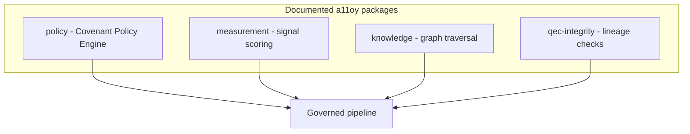

# a11oy - governed agentic execution fabric

<div class="quechua">
<strong>Etymology.</strong> <em>a11oy</em> is a coinage on the English word
<strong>alloy</strong>, styled in the <code>a11y</code> numeronym form. It is not a Quechua word.
</div>

## Overview

`a11oy` is SZL Holdings' documented seven-layer governed agentic execution fabric. Its public
source describes the composition of policy, measurement, knowledge, integrity checks, and a
receipt model. Source documentation is not proof that a public runtime is currently available;
see [Runtime status](/status) for the dated readiness observation.

The Lean corpus provides a formal-methods reference, but its proof status is mixed. In particular,
the [Evidence index](/evidence/) records open `sorry`-tagged PURIQ obligations and the doctrine
states that Lambda is Conjecture 1, not a theorem. This page therefore does not claim a universal
formal proof of execution safety or cryptographic signing at every transition.

**Anatomy mapping:** a11oy is the integration host. In the
[doctrine router](/doctrine/v11-v12), it associates source packages with the Memory, Yuyay, and
Hukulla concepts.


```mermaid
flowchart TD
    subgraph packages["Documented a11oy packages"]
        POL["policy - Covenant Policy Engine"]
        MEA["measurement - signal scoring"]
        KNO["knowledge - graph traversal"]
        QEC["qec-integrity - lineage checks"]
    end
    POL --> ALLOY["Governed pipeline"]
    MEA --> ALLOY
    KNO --> ALLOY
    QEC --> ALLOY
```

## Documented pipeline

The source documentation describes the following intended pipeline for a governed action:

1. **Signal ingress** - measurement scores events against configured baselines.
2. **Knowledge context** - knowledge retrieval supplies explanatory context.
3. **Policy evaluation** - policy evaluates an action against governance rules.
4. **Approval gate** - a human-approval record may be created when policy requires it.
5. **Execution boundary** - an admitted action can proceed after gate resolution.
6. **Integrity checks** - the QEC-integrity package supplies documented lineage checks.
7. **Receipt model** - a decision can be represented in the [Operator](/flagships/operator) Khipu model.

The source surface and any exact runtime, signature, or proof claim must be checked separately.

## Packages

| Package | Documented purpose | Key types |
|---------|--------------------|-----------|
| `packages/policy` | Covenant policy evaluation | `CovenantPolicy`, `ApprovalGate`, `PolicyDecision` |
| `packages/measurement` | Signal scoring and drift correlation | `SignalScore`, `PRISMFrame`, `DriftReport` |
| `packages/knowledge` | Knowledge-graph traversal and queries | `KnowledgeGraph`, `OntologyQuery`, `DomainNode` |
| `packages/qec-integrity` | CSS-QEC lineage representation | `QECLineage`, `IntegrityProof`, `CSSVector` |

## Source-local use

```bash
git clone https://github.com/szl-holdings/a11oy.git
cd a11oy
pnpm install --frozen-lockfile
pnpm build
```

No public npm-registry release is claimed for these workspace package names. Treat the checked-in
manifests and lockfile as the current developer entry point.

## Source and evidence

- **Source status:** `REAL` public repository surface.
- **Runtime availability:** use the dated [Runtime status](/status) observation; no source release is an uptime assertion.
- **Proof status:** `MIXED`; see [Evidence](/evidence/) and [Proof](/proof).
- **Receipt-signature status:** use [Compliance](/compliance) and the exact artifact; do not infer it from this product description.
- **Repo:** [github.com/szl-holdings/a11oy](https://github.com/szl-holdings/a11oy)
- **Platform host:** [szl-holdings/platform](https://github.com/szl-holdings/platform)
- **OpenSSF Scorecard:** 7.0 (2026-05-28) - [report](https://securityscorecards.dev/viewer/?uri=github.com/szl-holdings/a11oy)
- **Thesis v18 reference (not a software/product DOI):** [10.5281/zenodo.20434276](https://doi.org/10.5281/zenodo.20434276)
- **License:** Proprietary (fabric packages)
