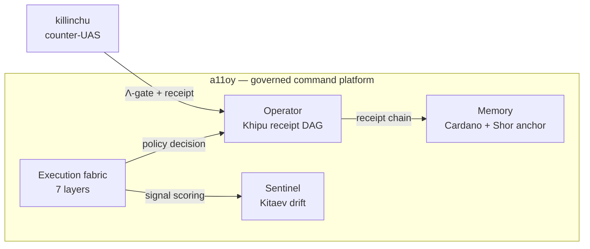

# Flagships

SZL Holdings ships **two products on one signed substrate**: **[a11oy](/flagships/a11oy)** — the
governed-AI command platform — and **[killinchu](/flagships/killinchu)** — counter-UAS drone &
vessel intelligence. a11oy delivers its capabilities as internal verticals — **Memory**,
**Sentinel**, and **Operator** — each mapped to an [anatomy organ](/anatomy/), cross-referenced
to the Ouroboros Thesis ([DOI 10.5281/zenodo.20434276](https://doi.org/10.5281/zenodo.20434276)),
and backed by the Lean kernel [`lutar-lean`](https://github.com/szl-holdings/lutar-lean).

| Surface | Part of | Name origin | Role | Source |
|---------|---------|-------------|------|--------|
| [a11oy](/flagships/a11oy) | product | *alloy* — blended hardened substrate | Governed execution fabric (7 layers) | [repo](https://github.com/szl-holdings/a11oy) |
| [a11oy Memory](/flagships/memory) | a11oy vertical | provenance & receipt anchoring | Cardano-anchored provenance | [repo](https://github.com/szl-holdings/a11oy) |
| [a11oy Sentinel](/flagships/sentinel) | a11oy vertical | security-posture guard | Kitaev-surface drift detection | [repo](https://github.com/szl-holdings/a11oy) |
| [a11oy Operator](/flagships/operator) | a11oy vertical | receipt-orchestration surface | Receipt-DAG orchestration | [repo](https://github.com/szl-holdings/a11oy) |
| [killinchu](/flagships/killinchu) | product | Quechua *killinchu* = kestrel | Counter-UAS drone intelligence | [repo](https://github.com/szl-holdings/killinchu) |

::: info Honesty note on SLSA
Some repo badges historically read "SLSA 3". The **doctrine-correct, honest level is
SLSA L1** — provenance is generated but not L3-verified, and cosign signing is **PENDING**
(see [Compliance & Security](/compliance)). Where this site and a badge disagree, this site
is correct.
:::
