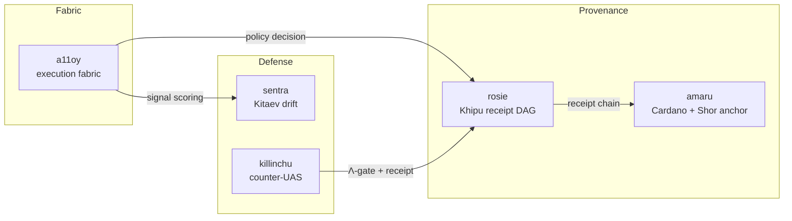

# Flagships

Five production repositories form the SZL Holdings surface. Each maps to one or more
[anatomy organs](/anatomy/), is cross-referenced to the Ouroboros Thesis
([DOI 10.5281/zenodo.20434276](https://doi.org/10.5281/zenodo.20434276)), and is backed by the
Lean kernel [`lutar-lean`](https://github.com/szl-holdings/lutar-lean).

| Flagship | Etymology | Role | Source |
|----------|-----------|------|--------|
| [a11oy](/flagships/a11oy) | *alloy* — blended hardened substrate | Governed execution fabric (7 layers) | [repo](https://github.com/szl-holdings/a11oy) |
| [amaru](/flagships/amaru) | Quechua *amaru* = serpent | Cardano-anchored provenance | [repo](https://github.com/szl-holdings/amaru) |
| [sentra](/flagships/sentra) | from *sentry* | Kitaev-surface drift detection | [repo](https://github.com/szl-holdings/sentra) |
| [killinchu](/flagships/killinchu) | Quechua *killinchu* = kestrel | Counter-UAS drone intelligence | [repo](https://github.com/szl-holdings/killinchu) |
| [rosie](/flagships/rosie) | ROSIE acronym | Receipt-DAG orchestration | [repo](https://github.com/szl-holdings/rosie) |

::: info Honesty note on SLSA
Some repo badges historically read "SLSA 3". The **doctrine-correct, honest level is
SLSA L1** — provenance is generated but not L3-verified, and cosign signing is **PENDING**
(see [Compliance & Security](/compliance)). Where this site and a badge disagree, this site
is correct.
:::
