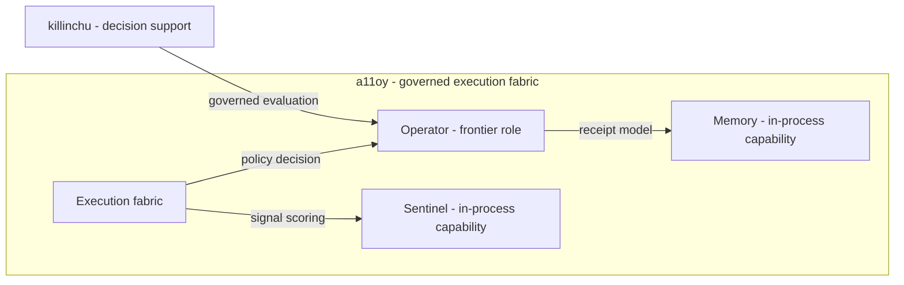

# Flagships

SZL documents two flagship source products: **[a11oy](/flagships/a11oy)**, the governed-AI
execution fabric, and **[killinchu](/flagships/killinchu)**, a counter-UAS decision-support
surface. A public-source product label is not a claim that a hosted runtime is currently
available; [Runtime status](/status) is authoritative for that question.

a11oy also documents **Memory**, **Sentinel**, and **Operator** as in-process capabilities and
frontier roles. They are not separately deployed services. Each is mapped to an
[anatomy organ](/anatomy/), cross-referenced to the Ouroboros Thesis
([DOI 10.5281/zenodo.20434276](https://doi.org/10.5281/zenodo.20434276)), and scoped by the
[Evidence](/evidence/) and [Compliance](/compliance) records.

```mermaid
flowchart LR
  subgraph A11OY["a11oy - governed execution fabric"]
    A[Execution fabric]
    M[Memory - in-process capability]
    R[Operator - frontier role]
    S[Sentinel - in-process capability]
  end
  K[killinchu - decision support]
  A -->|policy decision| R
  A -->|signal scoring| S
  R -->|receipt model| M
  K -->|governed evaluation| R
```

## Product and role map

| Surface | Product role | Source status | Standalone runtime | Source |
|---------|--------------|---------------|--------------------|--------|
| [a11oy](/flagships/a11oy) | flagship | `REAL` source surface | check [status](/status) | [repo](https://github.com/szl-holdings/a11oy) |
| [killinchu](/flagships/killinchu) | flagship | `REAL` source surface | check [status](/status) | [repo](https://github.com/szl-holdings/killinchu) |
| [a11oy Memory](/flagships/memory) | in-process capability / provenance role | `ROADMAP` as a standalone role | no standalone Space claimed | [repo](https://github.com/szl-holdings/a11oy) |
| [a11oy Sentinel](/flagships/sentinel) | in-process capability / policy role | `MIXED` implementation and roadmap claims | no standalone Space claimed | [repo](https://github.com/szl-holdings/a11oy) |
| [a11oy Operator](/flagships/operator) | in-process capability / receipt role | `ROADMAP` as a standalone role | no standalone Space claimed | [repo](https://github.com/szl-holdings/a11oy) |

::: info Evidence boundary
The documented supply-chain posture is **SLSA L1**. It is not an L3 claim. Khipu receipt
signature status is artifact-specific and governed by [Compliance & Security](/compliance).
Do not infer signing from a flagship label.
:::

For a public-safe investment view that keeps these distinctions intact, see the
[Investor brief](/investors/).
