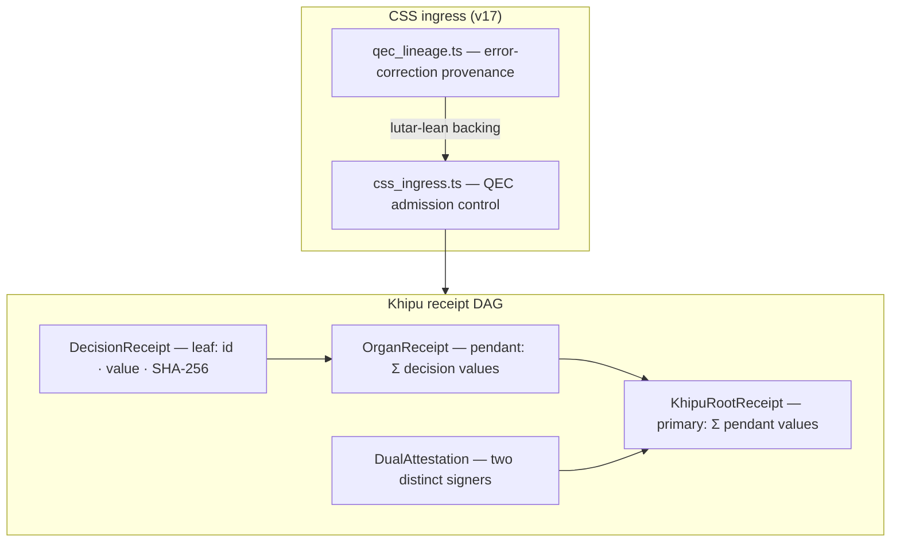

# a11oy Operator — receipt orchestration

> **a11oy Operator** is the admission-control & receipt-DAG vertical of [a11oy](/flagships/a11oy).

<div class="quechua">
<strong>Name origin.</strong> <em>Operator</em> is an English role name — the
<strong>R</strong>eceipt-<strong>O</strong>rchestrated <strong>S</strong>igned
<strong>I</strong>ngress <strong>E</strong>nvironment. Its structure, however, is pure Andean:
the receipt DAG is modelled directly on the Inka <em>khipu</em>.
</div>

## Overview

**a11oy Operator** is the **admission-control and receipt-DAG surface** of a11oy. It ships the
**Khipu-indexed receipt DAG** — a three-tier pendant-cord tree that records every governance
decision under a **summation-cord invariant** and an optional dual-attestation field. As of
v17 it also ships the **CSS (Calderbank-Shor-Steane) ingress** module: quantum-error-correcting
admission control for governed receipt streams.

> **Frontier capability.** First QEC-admission-controlled receipt DAG with CSS ingress and a
> kernel-verified sum invariant — `Lutar/Khipu/SummationInvariant` + CSS v17
> ([Ouroboros Thesis DOI 10.5281/zenodo.20434276](https://doi.org/10.5281/zenodo.20434276)).

**Anatomy mapping:** a11oy Operator is the operational [Khipu](/anatomy/#khipu) organ, fed by
[Yawar](/anatomy/#yawar) and anchored externally by [a11oy Memory](/flagships/memory).



## The summation invariant

The structural heart of a11oy Operator mirrors the Inka khipu primary-cord arithmetic:

$$ \text{rootValue} \;=\; \sum \text{pendantValues} \;=\; \sum \sum \text{decisionValues}. $$

Tampering with any leaf changes the root boundary sum — integrity by additive arithmetic,
not hash-collision resistance alone. This is formally verified in
[`lutar-lean`](https://github.com/szl-holdings/lutar-lean) as
`Lutar/Khipu/SummationInvariant.lean`, and is the algebraic root of the PURIQ
[INV-3 invariant](/doctrine/puriq#sf-06).

## What's here

| File | Purpose |
|------|---------|
| `src/khipu-receipt.ts` | Three-tier pendant-cord receipt DAG with sum-of-sums invariant |
| `src/qec/css_ingress.ts` | CSS ingress: QEC-governed admission control (v17, PR #6) |
| `src/qec/qec_lineage.ts` | QEC lineage tracking and provenance chain (v17, PR #6) |
| `tests/khipu-receipt.test.ts` | 10 runtime tests: TH11 failure modes, dual-attestation, R1/R2 smoke |
| `src/qec/css_ingress.test.ts` | CSS ingress tests |

## API / install

```bash
git clone https://github.com/szl-holdings/a11oy.git
cd a11oy
pnpm install
pnpm test   # 10 runtime tests
```

## Example — verify the invariant

```ts
import { KhipuRoot, verifySumInvariant, verifyDualAttestation } from './src/khipu-receipt'

const root = KhipuRoot.from(organReceipts)

verifySumInvariant(root)      // true ⇔ rootValue = Σ Σ decisionValues
verifyDualAttestation(root)   // P6 + P8 of A8: two distinct signers required
```

## Source & evidence

- **Repo:** [`a11oy`](https://github.com/szl-holdings/a11oy)
- **3D showcase (screenshots; not deployed):** [Operator-3D](/anatomy/3d-showcases#operator-3d)
- **Proof:** `Lutar/Khipu/SummationInvariant.lean` in [`lutar-lean`](https://github.com/szl-holdings/lutar-lean)
- **DOI:** [10.5281/zenodo.20434276](https://doi.org/10.5281/zenodo.20434276)
- **License:** Apache-2.0
