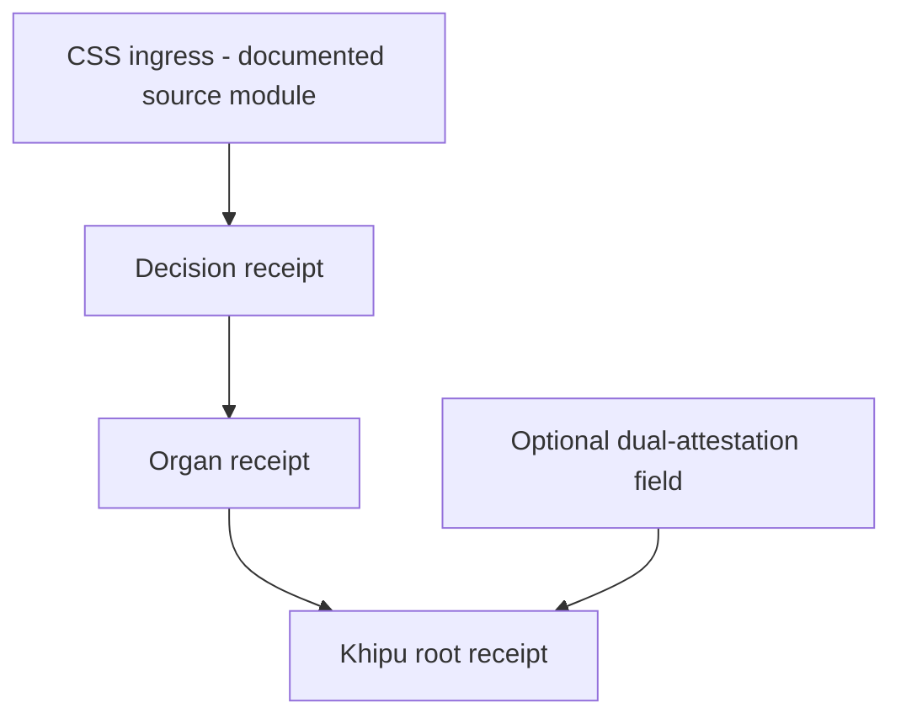

# a11oy Operator - receipt orchestration

> **Status:** Operator is documented as an a11oy in-process capability and frontier receipt role.
> It is not claimed as a separately deployed public service; see [Runtime status](/status).

## Overview

**a11oy Operator** documents a Khipu-indexed receipt-DAG model: a three-tier pendant-cord tree
that represents governance decisions with a summation invariant and an optional
dual-attestation field. The source contains a CSS ingress module and receipt-DAG implementation.
This is an implementation and design description, not a claim that every public receipt is
currently signed or that an independent Operator runtime is live.

The role maps to the [Khipu](/anatomy/#khipu) organ and is related to
[Yawar](/anatomy/#yawar). Signature status is governed by [Compliance](/compliance) and must be
checked on the exact artifact.

```mermaid
flowchart TD
    CI["CSS ingress - documented source module"] --> DR["Decision receipt"]
    DR --> OR["Organ receipt"]
    OR --> KR["Khipu root receipt"]
    DA["Optional dual-attestation field"] --> KR
```

## The summation invariant

The receipt model uses the arithmetic relationship:

$$ \text{rootValue} \;=\; \sum \text{pendantValues} \;=\; \sum \sum \text{decisionValues}. $$

The site links the relevant Lean file, `Lutar/Khipu/SummationInvariant.lean`, as proof evidence.
The overall formal-methods posture remains `MIXED`; read the [Evidence index](/evidence/) and
[Proof](/proof) rather than extrapolating a single invariant into a system-wide guarantee.

## Source and evidence

- **Role status:** `ROADMAP` as a standalone service; documented in-process receipt capability.
- **Source:** [`a11oy`](https://github.com/szl-holdings/a11oy)
- **Proof reference:** `Lutar/Khipu/SummationInvariant.lean` in [`lutar-lean`](https://github.com/szl-holdings/lutar-lean)
- **Signature posture:** [Compliance](/compliance) and the exact receipt artifact are authoritative.
- **3D showcase:** [screenshots only; not deployed](/anatomy/3d-showcases#operator-3d)
- **Thesis v18 reference (not a software/product DOI):** [10.5281/zenodo.20434276](https://doi.org/10.5281/zenodo.20434276)
