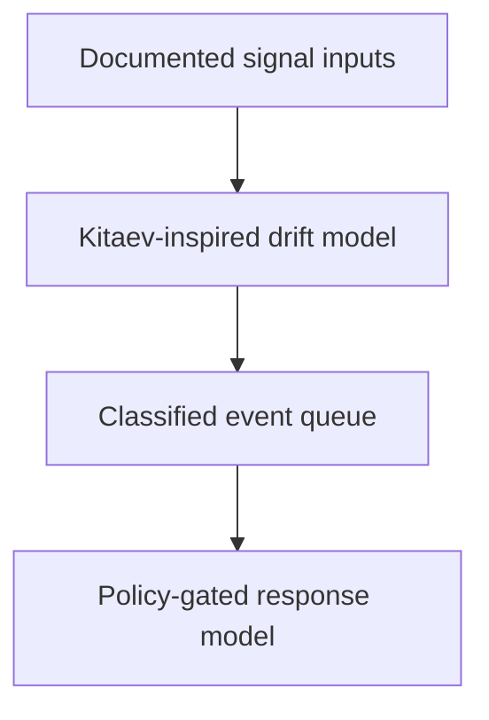

# a11oy Sentinel - drift detector

> **Status:** Sentinel is documented as an a11oy in-process capability and policy/observability
> role. It is not claimed as a separately deployed public service; see [Runtime status](/status).

## Overview

**a11oy Sentinel** documents a posture-drift approach that represents a security surface with a
Kitaev-inspired model, baseline comparison, and policy-gated response. It is an implementation
and architecture description, not a claim of a continuously operating enterprise monitoring
service or universally signed remediation record.

The role maps to [Hukulla](/anatomy/#hukulla) and the documented
[OTel-VSP](/anatomy/#otel-vsp) observability concepts. The site identifies telemetry and
cross-service wiring limits separately in [Runtime status](/status).

## Documented flow

1. **Posture scoring** compares an observed surface with a configured baseline.
2. **Drift events** classify a delta that crosses a policy threshold.
3. **Incident ordering** can prioritize events using documented severity inputs.
4. **Policy gating** represents a review boundary before a response.
5. **Receipt linkage** is a documented evidence model whose signature status remains artifact-specific.

The Lean corpus may be relevant to the model, but this page does not make a comparative "first"
claim or turn that reference into a proof of real-world cyber posture.

## Source and evidence

- **Role status:** `MIXED` implementation and roadmap claims; no standalone Space claimed.
- **Source:** [`a11oy`](https://github.com/szl-holdings/a11oy)
- **Model reference:** `Lutar/QEC/KitaevSurface` and the [Ouroboros Thesis](https://doi.org/10.5281/zenodo.20434276)
- **Runtime and telemetry status:** [Runtime status](/status)
- **Proof posture:** [Evidence](/evidence/) and [Proof](/proof)
