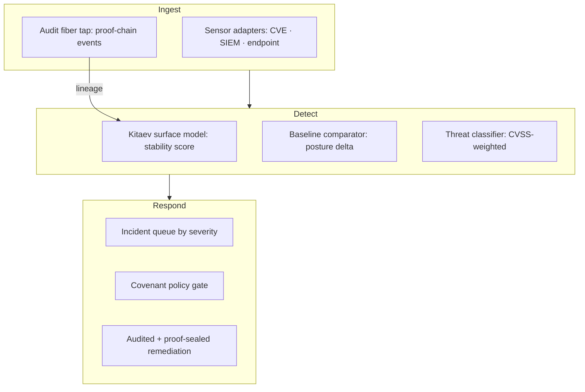

# sentra — drift detector

<div class="quechua">
<strong>Etymology.</strong> <em>sentra</em> is a coinage on the English <strong>sentry</strong>
(the guard who watches a boundary), styled to sit alongside the Quechua organ names. It is
not a Quechua word and is labelled honestly as such. Its job matches the name: it watches the
cyber-posture surface and raises a flag when it drifts.
</div>

## Overview

`sentra` is the **anomaly-detection and observability substrate** of the SZL governed
platform. It models enterprise cyber posture as a **Kitaev surface** — security state is a
topological surface, and drift is the deviation from the ground-state configuration.

> **Frontier capability.** First Kitaev-surface posture-drift detector on a Λ-axis-governed
> observability fiber — `Lutar/QEC/KitaevSurface` formal lattice basis
> ([Ouroboros Thesis DOI 10.5281/zenodo.20434276](https://doi.org/10.5281/zenodo.20434276)).

**Anatomy mapping:** sentra is the operational face of the [Hukulla](/anatomy/#hukulla)
immune system and the [OTel-VSP](/anatomy/#otel-vsp) nervous/observability fiber.



## How it works

1. **Continuous posture scoring** — a real-time topological stability score across the surface.
2. **Drift events** — any delta beyond the policy threshold raises a classified event.
3. **Incident queue** — events ranked by CVSS-weighted severity.
4. **Policy gate** — every remediation passes the [a11oy](/flagships/a11oy) Covenant gate.
5. **Proof chain** — every response is sealed in the SZL audit fiber with full attribution.

The Kitaev-surface stability model gives an objective stability scalar rather than a
hand-tuned alert threshold — drift is measured against a topological ground state.

## API / install

```bash
git clone https://github.com/szl-holdings/sentra.git
cd sentra
pnpm install
pnpm test
```

## Example — score posture drift

```ts
import { driftScore } from '@szl/sentra'

const report = driftScore({ baseline: surfaceA, observed: surfaceB })

console.log(report.stability) // topological stability score
report.events
  .sort((a, b) => b.cvss - a.cvss)
  .forEach(e => console.log(e.id, e.cvss, e.requiresApproval))
```

## Source & evidence

- **Repo:** [github.com/szl-holdings/sentra](https://github.com/szl-holdings/sentra)
- **Model:** Kitaev-surface basis in [ouroboros-thesis](https://github.com/szl-holdings/ouroboros-thesis), `Lutar/QEC/KitaevSurface`
- **DOI:** [10.5281/zenodo.20434276](https://doi.org/10.5281/zenodo.20434276)
- **License:** Proprietary
