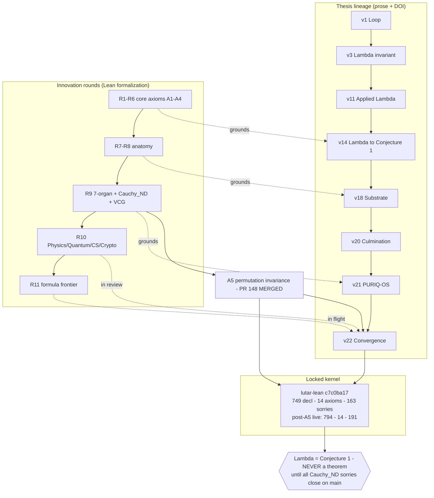

# Thesis Lineage — v1 → v22

**The intellectual provenance of SZL Holdings.** Every governance claim in the SZL substrate
traces to a versioned, DOI-pinned thesis. This is the canonical timeline.

- **Author:** Stephen P. Lutar Jr. · ORCID [0009-0001-0110-4173](https://orcid.org/0009-0001-0110-4173)
- **Concept DOI (always-latest):** [10.5281/zenodo.19944926](https://doi.org/10.5281/zenodo.19944926)
- **Doctrine:** v11 LOCKED — 749 declarations / 14 unique axioms / 163 sorries @ `c7c0ba17` (v11.1 in flight post-A5)
- **Λ status:** **Conjecture 1 — never a theorem.**
- **Canonical source:** [szl-papers / THESIS_LINEAGE.md](https://github.com/szl-holdings/szl-papers/blob/main/thesis/THESIS_LINEAGE.md)

## Canonical timeline

| Ver | Date | DOI | Key contribution |
|----|------|-----|------------------|
| **v1** | 2026-04-28 | [zenodo.19867281](https://doi.org/10.5281/zenodo.19867281) | The Ouroboros Loop — looped computation as a system primitive |
| **v2** | 2026-04-30 | [zenodo.19934129](https://doi.org/10.5281/zenodo.19934129) | "The Loop Is the Product" — first empirical pass |
| **v3** | 2026-05-02 | [zenodo.19983066](https://doi.org/10.5281/zenodo.19983066) | The **Lutar Invariant** Λ — closed-form aggregator |
| **v4** | 2026-05-04 | [zenodo.20020841](https://doi.org/10.5281/zenodo.20020841) | The Lutar Omega formalism |
| **v5** | 2026-05-04 | [zenodo.20020846](https://doi.org/10.5281/zenodo.20020846) | Prisca-GraphRAG + Tawa SAE |
| **v6** | 2026-05-04 | [zenodo.20020845](https://doi.org/10.5281/zenodo.20020845) | Sealed constitutional guardrails |
| **v7** | 2026-05-04 | [zenodo.20020848](https://doi.org/10.5281/zenodo.20020848) | Tiered continual learning |
| **v8** | 2026-05-04 | [zenodo.20020849](https://doi.org/10.5281/zenodo.20020849) | Free-energy active inference |
| **v9** | 2026-05-05 | [zenodo.20053148](https://doi.org/10.5281/zenodo.20053148) | Unified-Operational — the Lutar Invariant family |
| **v10** | 2026-05-05 | [zenodo.20053163](https://doi.org/10.5281/zenodo.20053163) | Exhaustive-Audit — the audit-closure operator Λ |
| **v11** | 2026-05-11 | [zenodo.20119582](https://doi.org/10.5281/zenodo.20119582) | Applied Λ — measured per-request overhead |
| **v12** | 2026-05-14 | [concept](https://doi.org/10.5281/zenodo.19944926) | The Λ-Ouroboros substrate — first four verified theorems |
| **v13** | 2026-05-18 | [concept](https://doi.org/10.5281/zenodo.19944926) | Anatomy as architecture |
| **v14** | 2026-05-28 | [zenodo.20173912](https://doi.org/10.5281/zenodo.20173912) | Verifiable multi-agent anatomy; **Λ downgraded to Conjecture 1** |
| **v15** | 2026-05-28 | [zenodo.20195368](https://doi.org/10.5281/zenodo.20195368) | Knot calculus for governed decision receipts |
| **v16** | 2026-05-28 | [concept](https://doi.org/10.5281/zenodo.19944926) | Λ-invariant stack + Feynman path-integral audit |
| **v17** | 2026-05-28 | [concept](https://doi.org/10.5281/zenodo.19944926) | Wheelerian audit closure; Shannon doctrine (Kraft) |
| **v18** | 2026-05-30 | [zenodo.20434276](https://doi.org/10.5281/zenodo.20434276) | **Multi-track Substrate Expansion** — 29 modules |
| **v19** | — | *(no release — version gap; v18 → v20)* | — |
| **v20** | 2026-06-01 | [concept](https://doi.org/10.5281/zenodo.19944926) | "The Culmination" — formally-verified anatomical substrate |
| **v21** | 2026-06-01 | [concept](https://doi.org/10.5281/zenodo.19944926) | **The PURIQ-OS Substrate** — 12-organ runtime, 23 agentic formulas |
| **v22** | 2026-06-03 | **DOI pending (founder mint)** | **"Convergence"** — A5 merge, Cauchy_ND partial, VCG, SLSA L2, Rounds 10–11, Sim-to-Real (α=0.10) |

::: tip v19 gap
Numbering jumped v18 → v20 during the late-May consolidation. There is no v19 paper or DOI; this is documented, not a missing artifact.
:::

## How innovation rounds (R1–R11) converge with thesis versions

## Recent advances landing in v22 (2026-06-03)

Honest status — only A5 is merged to `main`; the rest are **on-branch / in review**:

1. **A5 axiom merge — MERGED (PR #148).** `IsPermutationInvariant` added as a *structure field*
   (not a new axiom — axiom count stays **14**). Corrects the A1–A4 uniqueness gap with a verified
   counterexample Φ(x₁,x₂)=x₁^(2/3)·x₂^(1/3) and a 13-paper literature review.
2. **VCG truthfulness — in review (PR #172).** Dominant-strategy truth + individual rationality.
3. **Cauchy_ND partial closure — in review (PRs #173/#174/#175).** Topology landed true forms;
   functional analysis closed with 1 honest t=0 sorry; symmetric closed with A5 dependency.
4. **SLSA L2 achieved.** 5/5 GHCR images verified via `slsa-verifier`. **L1 + L2; NOT L3.**
5. **Innovation Rounds 10–11 — in review / in flight.** Physics, quantum, CS, crypto, distsys.
6. **Sim-to-Real benchmark (draft).** Walrus parallel; mean **α-gap = 0.10** across five regimes.

::: warning Λ remains Conjecture 1
The uniqueness chain is complete only when all Cauchy_ND sorries close on `main`. They have not. No SZL surface elevates Λ to a theorem.
:::
