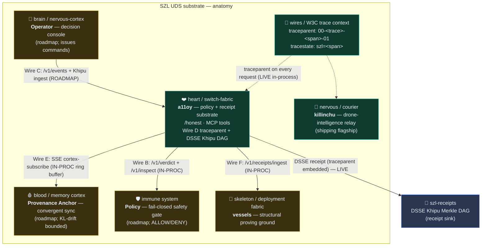

# UDS Mesh — the nervous system

The SZL substrate is modeled as a body. Two flagships ship today — **a11oy** (the
policy + receipt heart) and **killinchu** (drone-intelligence courier) — alongside three
roadmap/frontier roles: the **Provenance Anchor** (convergent memory sync), the
**Operator** (decision/receipt console), and the **Policy** drift detector (fail-closed
safety gate). Two structural organs complete the anatomy (**skeleton** = vessels /
deployment fabric, **wires** = the W3C-`traceparent` nervous signal). The mesh is the
**nervous system** that carries trace context + DSSE receipts between them.

::: tip Honest status legend
`LIVE` = wired and verified in-process · `IN-PROC` = real within a single organ, not
cross-pod · `ROADMAP` = v0.4.0, not shipped. **Honesty over checklist.**
The honest roles are Provenance Anchor, Operator, and Policy. Roadmap components have no live
Space today.
:::

## Wire status table (verified 2026-06-03)

| Wire | Edge | What it carries | Status |
|---|---|---|---|
| **B** | a11oy ↔ Policy (immune) | gate verdict / inspect | **IN-PROC (Policy = roadmap role)** |
| **C** | a11oy ↔ Operator (receipt stream) | decision events + Khipu ingest | **ROADMAP (Operator not deployed)** |
| **D** | W3C traceparent | real trace-id/span-id generation + propagation | **LIVE in-process; cross-Space broker NOT wired** |
| **E** | a11oy ↔ Provenance Anchor (cortex sync) | decision SSE events | **IN-PROC (in-memory ring buffer)** |
| **F** | a11oy ↔ vessels (receipts) | DSSE receipts into Khipu DAG | **LIVE (in-process)** |
| OTLP | any organ → collector | OTEL span export | **NOT WIRED — schema only (roadmap)** |
| cross-pod | organ ↔ organ over k8s Service | mTLS service mesh (Istio Package CR) | **ROADMAP v0.4.0** (verified: in-cluster ClusterIP call times out today) |

## What is real vs. aspirational

**Real, verified live (2026-06-03):**

- a11oy emits **real W3C trace context** — `traceparent: 00-<trace>--01`,
  `tracestate: szl=`, plus an `x-szl-wire-d: LIVE` marker — on every HTTP response.
  Incoming `trace_id` is preserved across the request (propagation verified).
- **a11oy** binds that traceparent into every **DSSE Khipu receipt** envelope (verified
  by decoding the base64 DSSE payload — the traceparent is embedded).
- Span **schemas** are published under a `szl.mesh.*` envelope as internal topic
  identifiers (`a11oy.graph`, plus reserved keys for the roadmap roles); these are
  technical schema names, not user-facing product names.
- In-cluster proof: a11oy runs 1/1 Ready in the `szl-stress` kind cluster and serves
  `{"status":"ok"}` on port 7860.

**Honest gaps (not yet wired):**

- **No OTLP export.** No `opentelemetry` package, no exporter, no collector — spans are a
  documented schema, not a live telemetry signal.
- **DSSE receipts are UNSIGNED** today (`signatures: []`) — the cosign private key
  (`SZL_COSIGN_PRIVATE_PEM`) is not present in the runtime.
- **Cross-pod organ traffic is NOT wired.** An in-cluster ClusterIP call times out; there
  is no Istio `Package` CR / service-discovery wiring in the bundle charts.
- **The Operator, Provenance Anchor, and Policy roles are roadmap** — they have no live
  Space today; only a11oy and killinchu ship.

> Until modules actually call each other across pods and spans are exported, this is a
> **live in-process governance signal**, not distributed telemetry — honestly short of a
> full service mesh. See `uds-bundles/mesh/docs/roadmap/MESH_INTERCONNECT.md`.

---

*Sources:
[`uds-bundles/mesh/schemas/spans/`](https://github.com/szl-holdings/uds-bundles/tree/main/mesh/schemas/spans),
[`MESH_INTERCONNECT.md`](https://github.com/szl-holdings/uds-bundles/blob/main/mesh/docs/roadmap/MESH_INTERCONNECT.md),
and the flagship `szl_provenance.py` / `szl_wire.py` runtime. Verified live by the
uds-fully-operational squad. Λ Conjecture 1 (not a theorem) · 749/14/163 v11 LOCKED ·
SLSA L1 honest · Section 889 = 5 vendors.*
