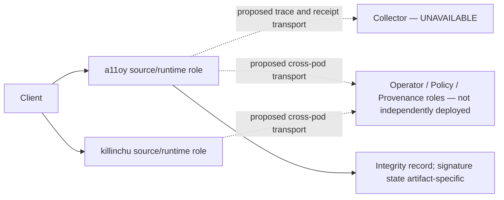

# UDS Mesh — evidence-bound architecture

The mesh is a design for carrying trace context and receipt-shaped records across SZL roles. The
two flagship **source** products are a11oy and killinchu. Provenance Anchor, Operator, Policy,
vessels, and cross-pod wiring remain architectural or in-process roles unless an exact deployment
witness says otherwise.

::: danger Current runtime boundary
The 2026-08-11 observation found a11oy readiness **UNAVAILABLE**, killinchu
**AVAILABLE_AT_OBSERVATION** only at its health route, and Hatun-MCP **UNAVAILABLE**. No current
distributed mesh, OTLP export, cross-pod traffic, or signed runtime receipt is claimed. See
[/status](/status).
:::

## Architecture map

```mermaid
flowchart LR
  CLIENT[Client] --> A11OY[a11oy source/runtime role]
  CLIENT --> KILLINCHU[killinchu source/runtime role]
  A11OY -. proposed trace and receipt transport .-> OTLP[Collector — UNAVAILABLE]
  A11OY -. proposed cross-pod transport .-> ROLES[Operator / Policy / Provenance roles — not independently deployed]
  KILLINCHU -. proposed cross-pod transport .-> ROLES
  A11OY --> RECORD[Integrity record; signature state artifact-specific]
```

## Evidence-class table

| Layer | What source describes | Current evidence |
|---|---|---|
| W3C trace context | `traceparent`/`tracestate` generation and propagation | Historical in-process observations only; no current cross-service witness |
| Receipt envelope | Trace-bound DSSE/Khipu-shaped record | Integrity fields may exist; runtime signing **UNAVAILABLE** unless exact bytes verify |
| OTLP | Export to a collector | **NOT WIRED / UNAVAILABLE** |
| Cross-pod mesh | Service discovery, mTLS, policy, retries | **UNAVAILABLE** |
| Role services | Operator, Policy, Provenance Anchor | No independent current deployment witness |
| Product readiness | a11oy / killinchu | Governed by [/runtime-status.json](/runtime-status.json) |

## Historical local observation — 2026-06-03

Prior project notes reported in-process trace headers and a local `kind` cluster response. Those
notes did not establish a public distributed mesh and are not current availability evidence. They
must not be relabeled `LIVE`; reproduce them at an exact source revision and preserve raw output
before reuse.

## Promotion gates

1. Bind every service to an immutable source and image digest.
2. Observe cross-pod requests with exact endpoint, trace IDs, and bounded timeouts.
3. Export spans to a named collector and read them back.
4. Preserve receipt bytes and classify integrity versus signature verification.
5. Run failure/retry/mTLS/policy tests and retain results.
6. Publish a source-bound deployment manifest and independent live readback.

Until all six close, the mesh remains an architecture with historical local evidence—not a
distributed production service.
