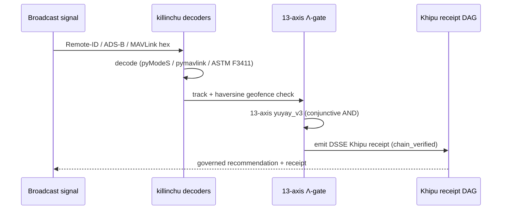

# Greene demo flow

An end-to-end counter-UAS decision-support walkthrough built on
[killinchu](/flagships/killinchu) and the [a11oy](/flagships/a11oy) Λ-gate — the path a
defense evaluator follows from a raw broadcast signal to a receipted, governed recommendation.

## The flow

1. **Ingest** a real broadcast self-ID (Remote-ID, ADS-B, or MAVLink) — `POST /v1/*/decode`.
2. **Geofence** — haversine breach check against the protected volume.
3. **Λ-gate** — fuse the geofence result with the [13-axis `yuyay_v3`](/doctrine/v11-v12) score;
   conjunctive AND, no compensation.
4. **Receipt** — emit a DSSE Khipu receipt into the in-memory Merkle DAG (real SHA-256).
5. **Recommendation** — a governed, auditable decision the operator can replay.

## Why it lands

Every step is **verifiable on disk**: the decode is a real protocol parse, the geofence is a
closed-form haversine, the Λ-gate returns a 13-entry score vector, and the receipt chains. An
evaluator can reproduce the entire path from the [killinchu API](/api/killinchu) without trusting
a single opaque step.

## Honest boundaries

- **Decision support only** — no autonomous engagement, no effector control.
- Broadcast signals are **unauthenticated and spoofable**; every decoded field is a *claim*.
- DSSE signatures are **PLACEHOLDER**; the receipt's SHA-256 chain is real (see
  [Compliance](/compliance)).

> This flow is the live, runnable counterpart to the [Quickstart killinchu step](/quickstart#_4-killinchu-decode-a-remote-id-frame).
