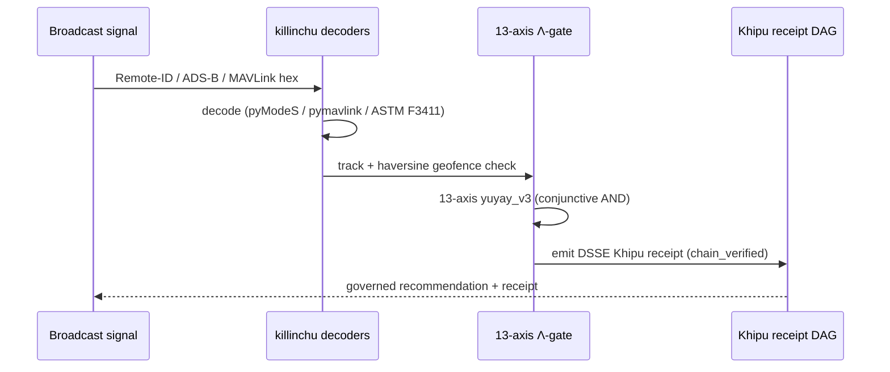

# Greene source-described flow

A historical/source-described counter-UAS decision-support walkthrough built around
[killinchu](/flagships/killinchu) and the [a11oy](/flagships/a11oy) Λ-gate. It models a path from
a raw broadcast signal to a receipted recommendation; it is not evidence that this end-to-end
path ran on the current hosted revision.

## The flow

```mermaid
sequenceDiagram
    participant S as Broadcast signal
    participant K as killinchu decoders
    participant L as 13-axis Λ-gate
    participant R as Khipu receipt DAG
    S->>K: Remote-ID / ADS-B / MAVLink hex
    K->>K: decode (pyModeS / pymavlink / ASTM F3411)
    K->>L: track + haversine geofence check
    L->>L: 13-axis yuyay_v3 (conjunctive AND)
    L->>R: emit DSSE Khipu receipt (chain_verified)
    R-->>S: governed recommendation + receipt
```

1. **Ingest (source-described)** a broadcast self-ID shape (Remote-ID, ADS-B, or MAVLink) through
   a documented `/v1/*/decode` route.
2. **Geofence (source-described)** — haversine breach check against the protected volume.
3. **Λ-gate (source-described)** — fuse the geofence result with the [13-axis `yuyay_v3`](/doctrine/v11-v12) score;
   conjunctive AND, no compensation.
4. **Receipt (source-described)** — form a Khipu receipt in an in-memory Merkle DAG; signature
   status remains `PLACEHOLDER`.
5. **Recommendation (source-described)** — return decision-support output for operator review.

## What the source flow demonstrates

Source inspection can audit the intended protocol parse, haversine calculation, 13-entry score
vector, and receipt-chain construction. The docs-site observation did not invoke the decode,
evaluation, or receipt routes, so hosted end-to-end reproducibility is **UNAVAILABLE** here. It
would require an exact-revision action-route response plus payload, authorization, dependency,
receipt, and independent readback evidence; the successful health response supplies none of
those bindings.

## Honest boundaries

- **Decision support only** — no autonomous engagement, no effector control.
- Broadcast signals are **unauthenticated and spoofable**; every decoded field is a *claim*.
- DSSE signatures are **PLACEHOLDER**; the receipt's SHA-256 chain is real (see
  [Compliance](/compliance)).
- Hosted evidence is **health-only**: `GET /api/killinchu/healthz` returned HTTP 200 at exact
  revision `83142da9526e2c0ddfe1e78eb99a20940cde0cf3` during the dated observation. No `/v1/*`
  route was witnessed.

> This flow is a source-described historical companion to the [Quickstart killinchu health step](/quickstart#_3-call-the-currently-ready-public-route). Recheck [/status](/status); health does not establish action-route availability.
